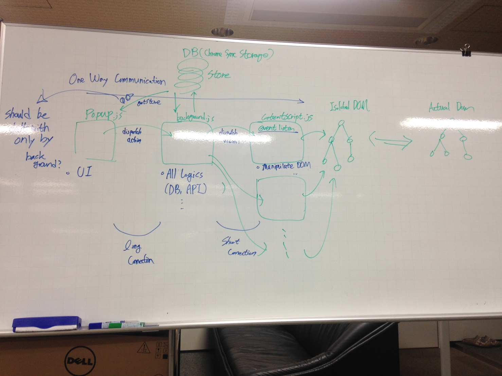

# Paste-it

## 1. Abstract

Save some tedious copy and paste texts to your google chrome storage and reuse any time!!

## 2. Motivation

I just created Paste-it when I just keep doing copy and paste my resume in enrolling internships..

## 3. How to implement locally

1. Open Chrome browser
2. Go to left upper `setting menu > more tools > Extensions`
3. Check developer mode on right upper side check box
4. Click `Load unpacked extensions ...`
5. Select Paste-it folder(including all files)
6. That's it!!!

## 4. Used tech stacks

- HTML / CSS
- Vanilla javascript(with redux style)
- chrome storage sync

## 5. Architecture

This app's core is made up of three parts.

Popup / Background / Content script

### Popup

`file: popup.js`

This part fully control the popup section managing its UI and inner logics

And, it also linked to the Background sending actions.

(It is inspired by redux)

### Background

`file: innerPage.js`

It takes care of app's background logics

### Content script

This part manipulates isolated DOM causing changing actual DOM.

## 6. For more info

I strongly suggest that those who have interests of this project should read this document first.

- [Whar are extesnions? - chrome developer](https://developer.chrome.com/extensions)

Thank you